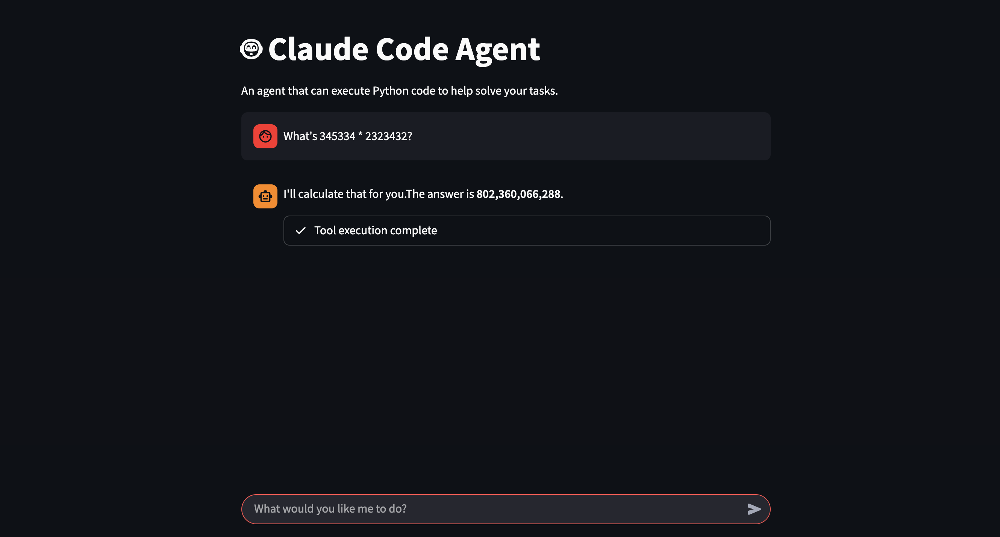

A minimal code interpreting agent in ~150 lines of Python.

# Live Demo
Running on Streamlit Community Cloud: [link](https://l3rqbsime5mrosntrpfab5.streamlit.app/)



# Prerequisites
1. Python 3.11+
2. [uv](https://docs.astral.sh/uv/) for dependency and environment management
3. Grab an Anthropic API key. Create a `.env` file in the root directory:
   ```env
   ANTHROPIC_API_KEY=your_api_key_here
   ```

# Run CLI Version
To run the agent in your terminal:
```bash
uv run agent.py
```

# Run Streamlit Demo
To run the web-based chat interface:
```bash
uv run streamlit run streamlit_app.py
```
